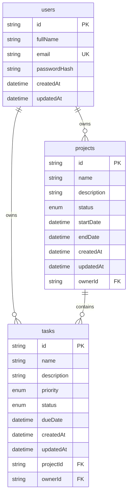

# Database Schema

The application uses PostgreSQL through Prisma ORM. All data is scoped by `ownerId` so users can only access their own projects and tasks.

Enums:

- `ProjectStatus`: `NOT_STARTED`, `IN_PROGRESS`, `COMPLETED`
- `TaskStatus`: `PENDING`, `IN_PROGRESS`, `COMPLETED`
- `TaskPriority`: `LOW`, `MEDIUM`, `HIGH`
